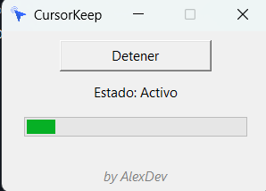

# 🖱️ CursorKeep

**CursorKeep** es una aplicación ligera y portátil desarrollada en Python que mantiene tu equipo activo simulando movimientos periódicos del cursor. Ideal para evitar bloqueos automáticos de pantalla, suspensiones por inactividad o desconexiones en sesiones remotas.

---

## 📦 Características

- ✅ Movimiento automático del cursor cada 30 segundos
- ✅ Interfaz gráfica amigable y compacta
- ✅ Barra de progreso visual sincronizada con el temporizador
- ✅ Botón de activación/desactivación en tiempo real
- ✅ Ejecutable portable (.exe) sin necesidad de instalación
- ✅ Ícono personalizado e identificación visual clara
- ✅ Código fuente disponible y editable

---

## 🖼️ Captura de pantalla



---

## 🚀 ¿Cómo usar CursorKeep?

### Opción 1: Ejecutar el programa (recomendado)

1. Descarga la versión más reciente desde la sección [📥 Releases](https://github.com/AlexPerez7/CursorKeep/releases)
2. Ejecuta `CursorKeep.exe` haciendo doble clic
3. Presiona el botón **Iniciar** para comenzar
4. El cursor se moverá automáticamente cada 30 segundos
5. Puedes presionar **Detener** para pausar la actividad

> 💡 No requiere Python ni instalación. Funciona directo.

---

### Opción 2: Compilar desde el código fuente (opcional)

Si quieres personalizar el código o generar tu propio `.exe`, sigue estos pasos:

#### 1. Requisitos

```bash
pip install pyautogui
pip install pyinstaller
```

#### 2. Comando de compilación

```bash
pyinstaller --noconsole --onefile --icon=cursorkeep.ico --add-data "cursorkeep.ico;." CursorKeep.py
```

> El ejecutable se generará en la carpeta `dist/`.

---

## 🛠 Estructura del proyecto

```
CursorKeep/
├── CursorKeep.py        # Código fuente
├── cursorkeep.ico       # Ícono personalizado
├── .gitignore           # Configuración Git
├── README.md            # Este archivo
```

---

## 📌 Notas adicionales

- Si Windows bloquea el archivo `.exe` tras la descarga, haz clic derecho → Propiedades → "Desbloquear"
- No se requiere instalación ni privilegios de administrador
- Compatible con Windows 10/11 (x64)

---

## 🔖 Versión

**Versión actual:** `v1.0.0`  
Publicado en [📄 Releases](https://github.com/AlexPerez7/CursorKeep/releases)
